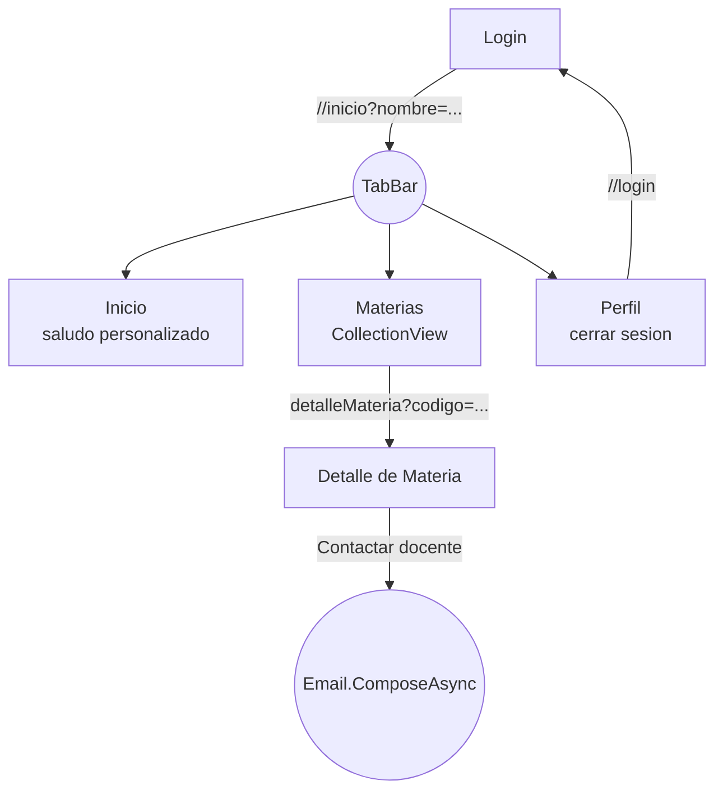

# Demo_FullNavigation (U2.4)

## Objetivo

Integrar los conceptos de U2.1, U2.2 y U2.3 en un mini-flujo cohesionado: login -> Shell con tabs -> detalle de materia -> tarea externa (correo al docente).

## Actividad

Responde a **U2.4 — Proyecto integrador de navegacion** del Tasks.md de la materia.

## Criterios de evaluacion

- Flujo continuo: login -> tabs -> detalle -> tarea externa.
- Tipos de navegacion correctos (replace para login, push para detalle, tarea externa para correo).
- Datos pasados entre pantallas via query parameters.
- Cierre de sesion regresa al login (replace).

## Diagrama del flujo implementado



## Codigo clave

```csharp
// LoginPage: replace + paso de nombre
await Shell.Current.GoToAsync($"//inicio?nombre={Uri.EscapeDataString(usuario)}");

// MateriasPage: push con codigo
await Shell.Current.GoToAsync($"detalleMateria?codigo={seleccionada.Codigo}");

// DetalleMateriaPage: contactar docente
await Email.Default.ComposeAsync(new EmailMessage
{
    Subject = $"[Link] {_materia.Codigo} {_materia.Nombre}",
    Body = $"Hola {_materia.Docente}, ...",
    To = new List<string> { _materia.CorreoDocente }
});

// PerfilPage: cerrar sesion (replace)
await Shell.Current.GoToAsync("//login");
```

## Como correr

```bash
# Windows
dotnet run --project Demo_FullNavigation.csproj -f net10.0-windows10.0.19041.0

# Android
dotnet build Demo_FullNavigation.csproj -f net10.0-android
```

## Screenshots

Coloca capturas en `Screenshots/`:

- `01_login.png`
- `02_tabs_inicio.png`
- `03_tabs_materias.png`
- `04_detalle.png`
- `05_correo.png`
