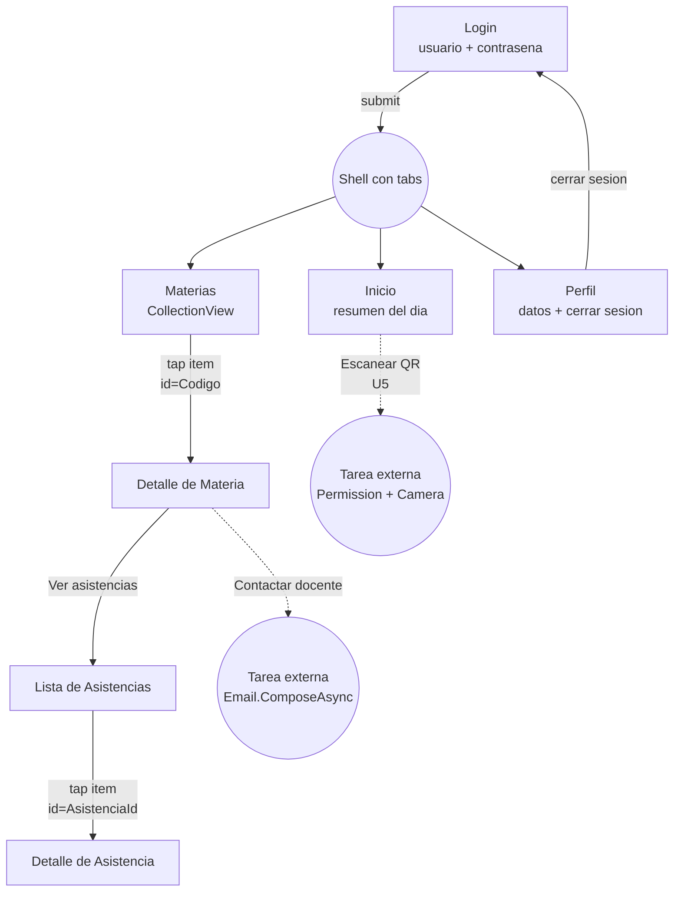

# Demo_NavigationFlow (U2.1)

## Objetivo

**Documentar** el flujo de navegacion completo de la app Link. No es codigo: es la base sobre la que se construyen las demos U2.2-U2.4 y el proyecto integrador `Link/`.

## Actividad

Responde a **U2.1 — Modelado del flujo de navegacion** del Tasks.md de la materia.

## Criterios de evaluacion

- Diagrama claro del flujo entre pantallas.
- Identificacion del tipo de navegacion (push, modal, replace).
- Identificacion explicita de los datos que se pasan entre pantallas.
- Wireframes textuales (ASCII o descripcion) de cada pantalla principal.

## Diagrama de navegacion



## Tabla de transiciones

| Origen | Destino | Tipo de navegacion | Datos pasados | Notas |
| --- | --- | --- | --- | --- |
| Login | Shell (tabs) | Replace (`//inicio`) | ninguno | Reemplaza la pila para que el back no vuelva al login |
| Tabs | Inicio / Materias / Perfil | Tab switch (Shell) | ninguno | Manejado por el TabBar del Shell |
| Materias | Detalle de Materia | Push (`detalleMateria?codigo=...`) | `codigo` (string) | Recibido con `[QueryProperty]` en la pagina destino |
| Detalle de Materia | Lista de Asistencias | Push (`asistencias?codigo=...`) | `codigo` (string) | Filtra asistencias por materia |
| Lista de Asistencias | Detalle de Asistencia | Push (`detalleAsistencia?id=...`) | `id` (Guid) | Carga la asistencia completa |
| Detalle de Materia | Email externo | Tarea externa | `to`, `subject`, `body` | `Email.Default.ComposeAsync` |
| Inicio | Camara externa (U5) | Tarea externa | ninguno | `MediaPicker` o ZXing |
| Perfil | Login | Replace (`//login`) | ninguno | Cierre de sesion |

## Wireframes (ASCII)

### Login

```
+------------------------------+
|                              |
|            Link              |
|   Registro de asistencias    |
|                              |
|   [ Usuario              ]   |
|   [ Contrasena           ]   |
|                              |
|   [        Ingresar      ]   |
|                              |
+------------------------------+
```

### Inicio (tab)

```
+------------------------------+
|  Inicio                      |
+------------------------------+
|  Hola, <nombre>              |
|                              |
|  +------------------------+  |
|  | Estado del proyecto    |  |
|  | U1-U3 listas...        |  |
|  +------------------------+  |
|                              |
+------------------------------+
| Inicio | Materias | Perfil   |
+------------------------------+
```

### Materias (tab)

```
+------------------------------+
|  Materias                    |
+------------------------------+
|  +------------------------+  |
|  | Aplicaciones Moviles   |  |
|  | MOV-2026-1             |  |
|  | Docente: ...           |  |
|  +------------------------+  |
|  +------------------------+  |
|  | Algoritmos Avanzados   |  |
|  | ALG-2026-1             |  |
|  +------------------------+  |
+------------------------------+
| Inicio | Materias | Perfil   |
+------------------------------+
```

### Detalle de Materia

```
+------------------------------+
| < Volver  Detalle            |
+------------------------------+
|  Aplicaciones Moviles        |
|  MOV-2026-1                  |
|  Docente: ...                |
|                              |
|  [ Ver asistencias       ]   |
|  [ Contactar docente     ]   |
+------------------------------+
```

### Detalle de Asistencia

```
+------------------------------+
| < Volver  Asistencia         |
+------------------------------+
|  Materia: MOV-2026-1         |
|  Estudiante: 1234567         |
|  Fecha: 2026-04-26 10:14     |
|  Estatus: Registrada         |
+------------------------------+
```

### Perfil (tab)

```
+------------------------------+
|  Perfil                      |
+------------------------------+
|  +------------------------+  |
|  | Nombre: ...            |  |
|  | Correo: ...@uabc.edu.mx|  |
|  +------------------------+  |
|                              |
|  [    Cerrar sesion     ]    |
+------------------------------+
| Inicio | Materias | Perfil   |
+------------------------------+
```

## Convencion de rutas

- `//login` y `//inicio` son rutas absolutas que **reemplazan la pila** (login y home logueado).
- `detalleMateria`, `asistencias`, `detalleAsistencia` son rutas relativas registradas dinamicamente con `Routing.RegisterRoute(...)` desde `AppShell.xaml.cs`.
- El paso de parametros usa querystring (`?codigo=...&id=...`) y `[QueryProperty(nameof(Codigo), "codigo")]` en la pagina destino.
