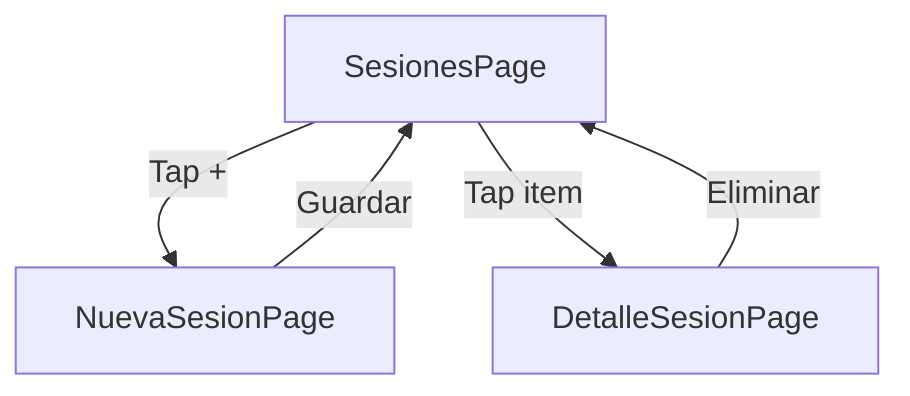

# Demo_PersistentData — Actividad 4.3

## Objetivo

Integrar listas dinamicas (`CollectionView`) con persistencia real (SQLite) en un mini-flujo coherente con la tematica del proyecto Link: registro manual de sesiones de clase.

## Actividad

Actividad 4.3 — Integracion de listas y base de datos local.

## Flujo de pantallas



## Codigo clave

### Modelo con porcentaje calculado

```csharp
public sealed class SesionClase
{
    [PrimaryKey, AutoIncrement]
    public int Id { get; set; }

    [NotNull]
    public string NombreMateria { get; set; } = string.Empty;

    public int Asistentes { get; set; }
    public int Total { get; set; }

    [Ignore]
    public double PorcentajeAsistencia =>
        Total > 0 ? (double)Asistentes / Total * 100 : 0;
}
```

### Validacion en ViewModel

```csharp
if (Asistentes > Total)
{
    Error = "Asistentes no puede ser mayor que el total";
    return;
}
```

### Indicador visual de porcentaje en CollectionView

```xml
<ProgressBar Progress="{Binding PorcentajeAsistencia, Converter={StaticResource PercentToProgressConverter}}"
             ProgressColor="{StaticResource Primary}" />
```

## Como correr

```bash
cd U4/Demo_PersistentData
dotnet restore
dotnet build -f net10.0-android
dotnet build -t:Run -f net10.0-android
```

## Screenshots

Ver carpeta [Screenshots/](Screenshots/).
