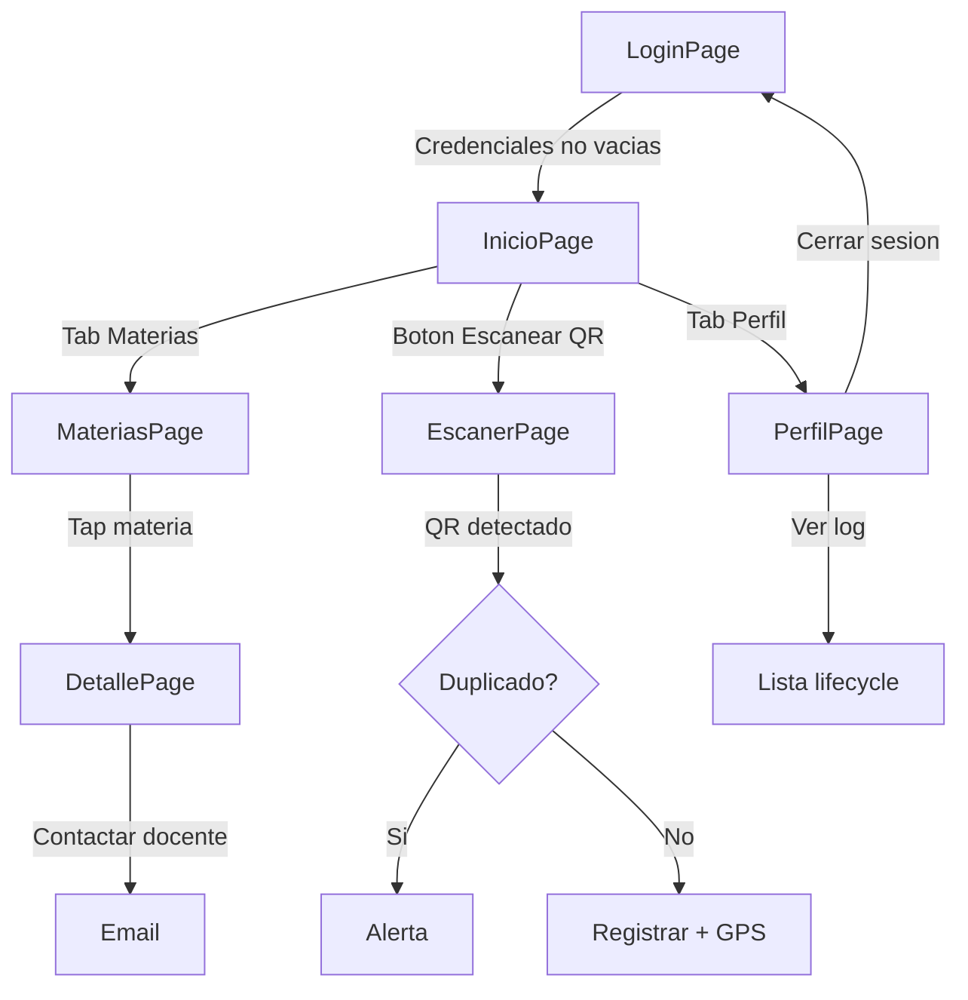

# Demo_FinalProject — Actividad 5.3 (Proyecto Integrador)

## Objetivo

Aplicacion autocontenida y completa del proyecto Link que integra todas las funcionalidades demostradas en U1-U5 en un flujo coherente de registro de asistencias mediante QR.

## Funcionalidades integradas

| Funcionalidad | Unidad de origen | Implementacion |
|---------------|------------------|----------------|
| Ciclo de vida (OnStart/OnSleep/OnResume) | U1 | Log en memoria visible desde Perfil |
| Login mock + persistencia de sesion | U2 | `Preferences.Default` para nombre de usuario |
| Navegacion Shell con tabs | U2, U3 | Inicio, Materias, Perfil + rutas registradas |
| Contactar docente (Email) | U2 | `Email.ComposeAsync` desde DetallePage |
| Material Design 3 | U3 | Paleta de colores, cards, botones, tipografia |
| Materias en SQLite | U4 | `sqlite-net-pcl` con seed data automatico |
| Historial de asistencias en SQLite | U4 | CRUD completo con CollectionView |
| Escaner QR | U5 | `ZXing.Net.MAUI` con deteccion de duplicados |
| GPS | U5 | Coordenadas opcionales al registrar asistencia |
| Estadisticas | Nuevo | ProgressBar, materia top, total asistencias |

## Decisiones tecnicas

### ZXing.Net.MAUI
Se usa `ZXing.Net.Maui.Controls` v0.4.0 porque es el unico paquete que combina camara + decodificacion QR en un solo control XAML. Alternativas como decodificar manualmente frames de `CommunityToolkit.Maui.Camera` requieren significativamente mas codigo.

### GPS opcional
El GPS se solicita con timeout de 5 segundos al escanear. Si falla (sin permiso, sin senal, timeout), la asistencia se registra sin coordenadas. Esto evita bloquear el flujo principal por una funcionalidad secundaria.

### Deteccion de duplicados
Antes de registrar, se verifica si existe una asistencia con el mismo contenido QR en los ultimos 5 minutos. Esto previene registros accidentales multiples por re-escaneos.

## Flujo de la app



## Setup

### Permisos Android
Definidos en `Platforms/Android/AndroidManifest.xml`:
- `CAMERA` — requerido para ZXing
- `ACCESS_FINE_LOCATION` — para GPS
- `ACCESS_COARSE_LOCATION` — fallback GPS

### Emulador
- **GPS:** Extended Controls > Location > Lat 32.5027, Lng -117.0037
- **QR:** Generar un QR con texto (ej: "Aplicaciones Moviles") en https://www.qr-code-generator.com/ y mostrarlo frente a la webcam del emulador.

### Comandos

```bash
cd U5/Demo_FinalProject
dotnet restore
dotnet build -f net10.0-android
dotnet build -t:Run -f net10.0-android
```

## Manual de usuario

**Login:** Ingresa cualquier nombre de usuario y contrasena no vacios. El nombre se persiste para mostrarse en el perfil.

**Inicio:** Muestra un resumen con total de asistencias registradas, materia con mas asistencias, y un indicador de progreso general. El boton "Escanear QR" abre el escaner.

**Materias:** Lista de materias precargadas desde SQLite. Al tocar una materia se ve su detalle con opcion de contactar al docente por email.

**Escaner:** Abre la camara y detecta codigos QR automaticamente. Al detectar uno, registra la asistencia con timestamp y coordenadas GPS (si estan disponibles). Si el QR ya fue escaneado en los ultimos 5 minutos, muestra una alerta.

**Perfil:** Muestra nombre de usuario, total de asistencias, ultima ubicacion registrada, y un boton para ver el log de ciclo de vida de la app. Permite cerrar sesion.

## Screenshots

Ver carpeta [Screenshots/](Screenshots/).
